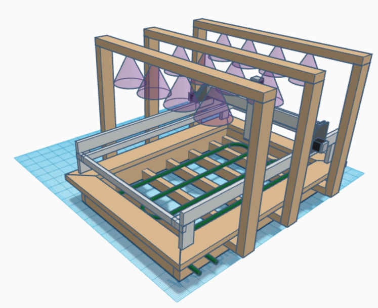

## What is LOMAS?

### Parts
#### Node-red 
High-level control and logic
* Webbased user interface (HMI)

#### ROS
Low-level control and logic
* Interface module to telemetry sensors throw firmata protocol
* Interface module to machine throw G-Code protocol

#### CNC.js
Advance machine user interface for G-Code

### Installation
See wiki for installation instructions

### Progress

[Read about the progress in the projects GitHub](blog/blog.md)

