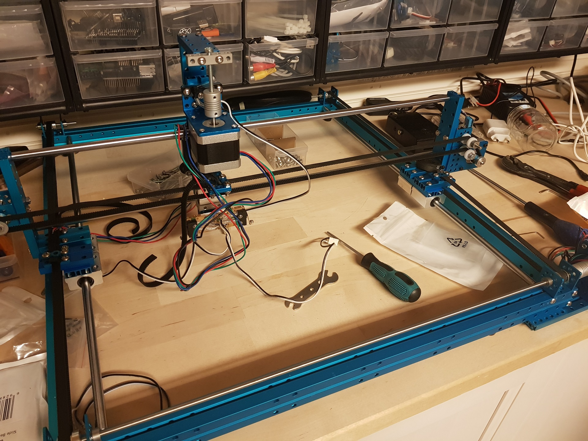
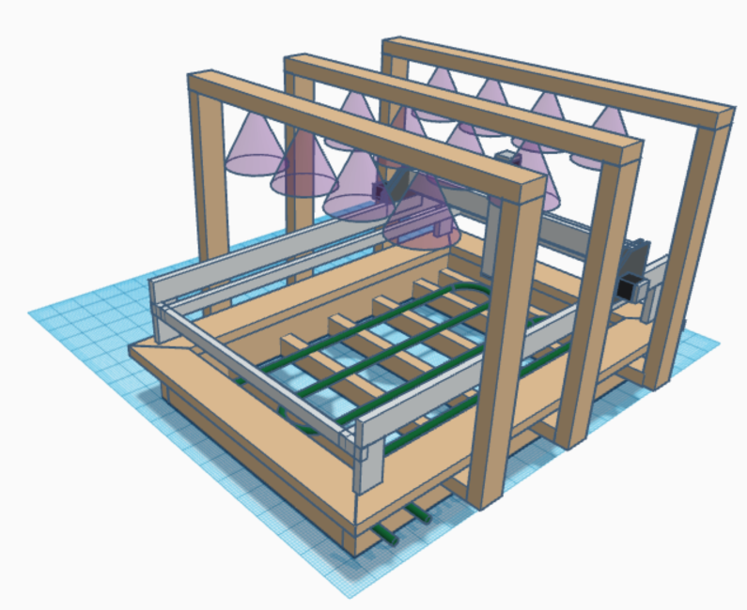

## Progress

[<-Back](../README.md)

### 2017-09-28 HMI based on Node-Red 
Starting to test miniature LOMAS with easy user interface

### 2017-09-27 LOMAS gets its own laboratory 
The miniature LOMAS is alive and some parts of the code is starting to be tested.

### 2017-09-14 BOM list is done
BOM list is done and time to order parts for full size prototype

### 2017-09-12 Assembly of miniature LOMAS is almost done 
The miniature LOMAS is alive and some parts of the code is starting to be tested.

### 2017-09-06 Prototype concept created 

